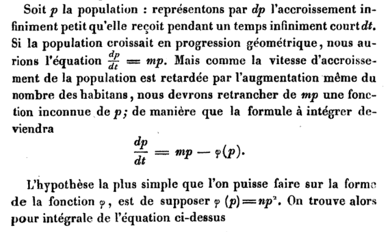

```{r setup, include=FALSE}
knitr::opts_chunk$set(echo = TRUE, collapse = T)
library(package = "deSolve")
```

# Creating a density-dependent model, au Français

---
# Creating a density-dependent model, translated


*If $p$ is the population, then $dp$ is an infinitesimally small increase that is received in a very short period of time $dt$. If the population increase by geometric progression, we would have the equations $\frac{dp}{dt} = mp$. However, as the rate of population growth is slowed by the very increase in the number of inhabitants, we must subtract from $mp$ an unknown function of $p$, so that the formula to be integrated can be written as*
$$\frac{dp}{dt} = mp - \varphi (p)$$
*The simplest hypothesis that can be made on the form of the function $\varphi$ is to suppose that $\varphi (p) = np^2$.*
---
# The logistic model: a balance of forces
Most generally, we wish model population growth with two functions that capture two biological phenomena, growth and crowding.
--
$$\frac{\Delta N}{\Delta t} = f(N),$$ 
with $f(N)$ describing growth and crowding:

--

$$f(N) = \text{growth} - \text{crowding}.$$
--

Let growth be $rN$ and crowding be $\alpha N^2$, to give us
$$\frac{\Delta N}{\Delta t} = rN - \alpha N^2$$
--
In continuous and discrete time the logistic equations are respectively:  
$$\begin{align}
\frac{\mathrm{d}N}{\mathrm{d}t} &= rN - \alpha N^2 \\
N_{t+1} &= \lambda N_t - \alpha N_t^2
\end{align}$$

---
# Births and deaths in the logistic model
(I'm only describing continuous time, but it's analagous in discrete time) A generalized way of writing a more mechanistic model of births and deaths into the logisitc model is respectively by the use of functions of $N$, $B(N)$ and $D(N)$:
--
$$\frac{\mathrm{d}N}{\mathrm{d}t} = B(N) - D(N)$$
--
Let's say that both per-capita births and death rates linearly decrease as a function of density, $N$. So, we can write:
--
$$\frac{\mathrm{d}N}{\mathrm{d}t} = (bN - \mu N^2) - (dN - \nu N^2)$$
--
Linearity becomes clear when we write this as *per-capita* by dividing both sides by $N$:
$$\frac{1}{N}\frac{\mathrm{d}N}{\mathrm{d}t} = (b - \mu N) - (d - \nu N)$$

---
# The $K$-logistic model
Another common representation of density-dependent change---i.e., a logistic model---is the $r-K$ model. This model incorporates a "maximum" population size, $K$, below which the rate of change increases and above witch the population decreases. Here, it reads:
$$\frac{\mathrm{d}N}{\mathrm{d}t} = rN\left(\frac{K - N}{K}\right)$$
--
If we multiply the factors, we have:
$$\frac{\mathrm{d}N}{\mathrm{d}t} = rN - \frac{r}{K}N^2$$
--
We now see the equivalence to the $r-\alpha$ model:
$$\frac{\mathrm{d}N}{\mathrm{d}t} = rN - \frac{r}{K}N^2 = rN - \alpha N^2,$$
where $\alpha = \frac{r}{K}$. Although these models are mathematically equivalent, they are *not* biologically equivalent for reasons I will complain about later, including that the growth parameter is in the growth term *and* the crowding term. *C'est n'est pas bon*.


---
class: inverse, center, middle
<a href="https://imgflip.com/i/25ds0b"></a>

---
# We have (a) model(s)—let's do all of the things!
* Analyze it!
  * Simulate it
  * Solve it
  * Find equilibria (long-term behavior)
  * Determine stability (behavior if perturbed)
* Visualize it!
  * Plot a time series
  * Plot population size $(N)$ and population growth $\left(\frac{dN}{dt}\right)$
  * Plot population size $(N)$ and per-capita growth $\left(\frac{1}{N}\frac{dN}{dt}\right)$
  
---
# Analyze it!: simulation
.pull-left[
Exactly what you did yesterday:
```{r, fig.height = 4.5, fig.width = 4.5, echo = F, dpi = 500}
logistic <- function(t, y, p) {
  N <- 1.5*y - 0.15*y^2
  return(list(N))
}
out <- ode(y = 0.01, times = seq(0, 10, 0.01), parms = NA, func = logistic)
par(mar = c(4, 4, 0.1, 0.1), oma = c(0, 0, 0, 0))
plot(x = out[,1], y = out[,2], las = 1, xlab = "Time", ylab = "Density (N)", type = "l", lwd = 2)
```
]

--
.pull-right[
But also vary parameters (here, $r$):
```{r many.log, fig.height = 4.5, fig.width = 4.5, echo = F, dpi = 500}
logistic <- function(t, y, parms) {
  lam <- parms
  N <- lam*y - 0.01*y^2
  return(list(N))
}
par(mar = c(4, 4, 0.1, 0.1), oma = rep(0, 4))
plot(NA, las = 1, xlab = "Time", ylab = "Density (N)", type = "n", xlim = c(0, 30), ylim = c(0, 180))
l.seq <- seq(0.5, 1.8, length.out = 20)
col.pal <- colorRampPalette(c("red", "blue"))
for (i in 1:20) {
parms <- c(lam = l.seq[i])
out <- ode(y = 0.01, times = seq(0, 30, 0.01), parms = parms, func = logistic)
par(mar = c(3, 3, 0.1, 0.1), oma = rep(0, 4))
lines(x = out[,1], y = out[,2], col = col.pal(20)[i], lwd = 2)
}
```
]

---
#Analyze it!: solve it
For the $r\text{-}\alpha$ logistic equation:
$$N(t) = \frac{rN(0)e^{rt}}{r + \alpha N(0)\left(e^{rt} - 1\right)}$$

--

For the $K$ logistic equation:
$$N(t) = \frac{KN(0)e^{rt}}{K + N(0)\left(e^{rt} - 1\right)}$$
--

** This will be the final analytical solution in this class 😥 **

---
#Analyze it!: finding equlibria

The continuous logistic
$$\begin{align}\frac{\mathrm{d}N}{\mathrm{d}t} &= rN - \alpha N^2 \\
0 &= rN - \alpha N^2 \\
0 &= N\left(r - \alpha N\right) \\
N^* &= 0 \\
0 &= r - \alpha N\\
\alpha N &= r \\
N^* &= \frac{r}{\alpha}
\end{align}$$

---
#Analyze it!: finding equlibria

The discrete logistic
$$\begin{align}
N_{t+1} &= \lambda N_t - \alpha N_t^2 \\
N_t &= \lambda N_t - \alpha N_t^2 \\
0 &= \lambda N_t - \alpha N_t^2 - N_t \\
0 &= N_t \left(\lambda - \alpha N_t - 1 \right) \\
N^* &= 0 \\
0 &= N_t \left(\lambda - \alpha N_t - 1 \right) \\
0 &= \lambda - \alpha N_t - 1 \\
\alpha N_t &= \lambda - 1 \\
N^* &= \frac{\lambda - 1}{\alpha}
\end{align}$$

---
# Analyze it!: perturbation
Perturb the equilibira! Actually, we'll cover more of this in Ch. 4, *Dynamics.*


---
# Visualize it!: time series

```{r fig.height = 4, fig.width = 4, echo = T}
logistic <- function(t, y, p) {
  N <- 1.5*y - 0.15*y^2
  return(list(N))
}
out <- ode(y = 0.01, times = seq(0, 10, 0.01), parms = NA, func = logistic)
par(mar = c(4, 4, 0.1, 0.1), oma = c(0, 0, 0, 0))
plot(x = out[,1], y = out[,2], las = 1, xlab = "Time", ylab = "Density (N)", type = "l", lwd = 2)
```

---
# Visualize it!: population growth and density

```{r fig.height = 4, fig.width = 4, echo = T}
logistic <- function(t, y, p) {
  N <- 1.5*y - 0.15*y^2
  return(list(N))
}
out <- ode(y = 0.01, times = seq(0, 10, 0.01), parms = NA, func = logistic)
par(mar = c(4, 4, 0.1, 0.1), oma = c(0, 0, 0, 0))
len.out <- nrow(out)
plot(x = out[1:(len.out-1),2], y = (out[2:len.out,2] - out[1:(len.out-1),2]), las = 1, xlab = "Density (N)", ylab = "Population growth (dN/dt)", type = "l", lwd = 2)
```

---
# Visualize it!: per-capita growth and density
```{r fig.height = 4, fig.width = 4, echo = T}
logistic <- function(t, y, p) {
  N <- 1.5*y - 0.15*y^2
  return(list(N))
}
out <- ode(y = 0.01, times = seq(0, 10, 0.01), parms = NA, func = logistic)
par(mar = c(4, 4, 0.1, 0.1), oma = c(0, 0, 0, 0))
len.out <- nrow(out)
plot(x = out[1:(len.out-1),2], y = (out[2:len.out,2] - out[1:(len.out-1),2])/out[1:(len.out-1),2], las = 1, xlab = "Density (N)", ylab = "Per calita growth (dN/dt/N)", type = "l", lwd = 2)
```

---
# Discrete-time density dependence

--
Hassel (also Bleasdale and Nedler) model:
$$N_{t+1} = \frac{\lambda N_t}{\left(1 + \alpha N_t\right)^b}$$

--
Beverton and Holt (same as Hassel when $b = 1$):
$$N_{t+1} = \frac{\lambda N_t}{\left(1 + \alpha N_t\right)}$$
--
The Ricker equation:
$$N_{t+1} = N_t \exp\left(r\left(1 - bN_t\right)\right)$$

---
# Analyze it!: simulation

.pull-left[
Choosing the Hassell model:
```{r, fig.height = 4.5, fig.width = 4.5, echo = F, dpi = 500}
Hassell <- function(t, y, p) {
  Nt <- y
  lambda <- p["lambda"]
  alpha <- p["alpha"]
  b <- p["b"]
  Nt1 <- lambda*Nt/((1 + alpha*Nt)^b)
  return(list(Nt1))
}
Hassell.parms <- c(lambda = 1.5, alpha = 2, b = 0.5)
out <- ode(y = 0.01, times = seq(0, 20, 1), parms = Hassell.parms, func = Hassell, method = "iteration")
par(mar = c(4, 4, 0.1, 0.1), oma = c(0, 0, 0, 0))
plot(x = out[,1], y = out[,2], las = 1, xlab = "Time", ylab = "Density (N)", type = "p", pch = 16)
  segments(x0 = out[,1][-nrow(out)], y0 = out[,2][-nrow(out)], x1 = out[,1][-1], y1 = out[,2][-nrow(out)], lwd = 2)

```
]

--
.pull-right[
But also vary parameters (here, $b$):
```{r many.disc.log, fig.height = 4.5, fig.width = 4.5, echo = F, dpi = 500}
Hassell <- function(t, y, p) {
  Nt <- y
  lambda <- p["lambda"]
  alpha <- p["alpha"]
  b <- p["b"]
  Nt1 <- lambda*Nt/((1 + alpha*Nt)^b)
  return(list(Nt1))
}
Hassell.parms <- c(lambda = 1.5, alpha = 2, b = 0.5)
par(mar = c(4, 4, 0.1, 0.1), oma = rep(0, 4))
plot(NA, las = 1, xlab = "Time", ylab = "Density (N)", type = "n", xlim = c(0, 30), ylim = c(0, 2))
l.seq <- seq(from = 0.25, to = 0.75, length.out = 20)
col.pal <- colorRampPalette(c("red", "blue"))
for (i in 1:20) {
parms <- Hassell.parms
parms["b"] <- c(lam = l.seq[i])
out <- ode(y = 0.01, times = seq(0, 30, 1), parms = parms, func = Hassell, method = "iteration")
par(mar = c(3, 3, 0.1, 0.1), oma = rep(0, 4))
points(x = out[,1], y = out[,2], col = col.pal(20)[i], pch = 16, cex = 0.9)
segments(x0 = out[,1][-nrow(out)], y0 = out[,2][-nrow(out)], x1 = out[,1][-1], y1 = out[,2][-nrow(out)], lwd = 2, col = col.pal(20)[i])
}
```
]

---
# Analyze it!: solve it and find equilibria

1. No analytical solutions
2. We can find equilibira for some!
   - For discrete-time equations, set $N_{t + 1} = N^*$ and $N_t = N^*$, and solve for $N^*$
   - E.g., 

$$\begin{align}
N_{t+1} &= \frac{\lambda N_t}{1 + \alpha N_t} =  \\
N^* &=\frac{\lambda N^*}{1 + \alpha N^*} \\
N^* &= 0,~\text{Equilibrium 1} \\
1 &= \frac{\lambda}{1 + \alpha N^*} \\
1 + \alpha N^* &= \lambda \\
\alpha N^* &= \lambda - 1 \\
N^* &= \frac{\lambda - 1}{\alpha},~\text{Equilibrium 2}\\
\end{align}$$

---
# Analyze it!: perturb equilibira
Again, more on this in a few weeks.

---
# Visualize it!: time series
```{r fig.height = 4, fig.width = 4, eval = F}
Hassell <- function(t, y, p) {
  Nt <- y
  lambda <- p["lambda"]
  alpha <- p["alpha"]
  b <- p["b"]
  Nt1 <- lambda*Nt/((1 + alpha*Nt)^b)
  return(list(Nt1))
}
Hassell.parms <- c(lambda = 1.5, alpha = 2, b = 0.5)
out <- ode(y = 0.01, times = seq(0, 25, 1), parms = Hassell.parms, func = Hassell, method = "iteration")
par(mar = c(4, 4, 0.1, 0.1), oma = c(0, 0, 0, 0))
plot(x = out[,1], y = out[,2], las = 1, xlab = "Time", ylab = "Density (N)", type = "p", lwd = 2, pch = 16)
  segments(x0 = out[,1][-nrow(out)], y0 = out[,2][-nrow(out)], x1 = out[,1][-1], y1 = out[,2][-nrow(out)], lwd = 2)
```

---
# Visualize it!: time series
```{r fig.height = 6, fig.width = 6, echo = F}
Hassell <- function(t, y, p) {
  Nt <- y
  lambda <- p["lambda"]
  alpha <- p["alpha"]
  b <- p["b"]
  Nt1 <- lambda*Nt/((1 + alpha*Nt)^b)
  return(list(Nt1))
}
Hassell.parms <- c(lambda = 1.5, alpha = 2, b = 0.5)
out <- ode(y = 0.01, times = seq(0, 25, 1), parms = Hassell.parms, func = Hassell, method = "iteration")
par(mar = c(4, 4, 0.1, 0.1), oma = c(0, 0, 0, 0))
plot(x = out[,1], y = out[,2], las = 1, xlab = "Time", ylab = "Density (N)", type = "p", lwd = 2, pch = 16)
  segments(x0 = out[,1][-nrow(out)], y0 = out[,2][-nrow(out)], x1 = out[,1][-1], y1 = out[,2][-nrow(out)], lwd = 2)
```

---
# Visualize it!: population growth and density

```{r eval = F, echo = T}
Hassell <- function(t, y, p) {
  Nt <- y
  lambda <- p["lambda"]
  alpha <- p["alpha"]
  b <- p["b"]
  Nt1 <- lambda*Nt/((1 + alpha*Nt)^b)
  return(list(Nt1))
}
Hassell.parms <- c(lambda = 1.5, alpha = 2, b = 0.5)
out <- ode(y = 0.001, times = seq(0, 40, 1), parms = Hassell.parms, func = Hassell, method = "iteration")
Hassell.out <- out[-1,2] - out[-nrow(out),2]
plot(x = out[1:(nrow(out)-1),2], y = Hassell.out, las = 1, xlab = "Density (N)", ylab = bquote("Population growth N"[t+1]-"N"[t]), type = "l", lwd = 2)
```

---
# Visualize it!: population growth and density

```{r fig.height = 6, fig.width = 6, echo = F}
Hassell <- function(t, y, p) {
  Nt <- y
  lambda <- p["lambda"]
  alpha <- p["alpha"]
  b <- p["b"]
  Nt1 <- lambda*Nt/((1 + alpha*Nt)^b)
  return(list(Nt1))
}
Hassell.parms <- c(lambda = 1.5, alpha = 2, b = 0.5)
out <- ode(y = 0.001, times = seq(0, 40, 1), parms = Hassell.parms, func = Hassell, method = "iteration")
Hassell.out <- out[-1,2] - out[-nrow(out),2]
plot(x = out[1:(nrow(out)-1),2], y = Hassell.out, las = 1, xlab = "Density (N)", ylab = bquote("Population growth N"[t+1]-"N"[t]), type = "l", lwd = 2)
```

---
# Visualize it!: per-capita growth and density

```{r eval = F, echo = T}
Hassell <- function(t, y, p) {
  Nt <- y
  lambda <- p["lambda"]
  alpha <- p["alpha"]
  b <- p["b"]
  Nt1 <- lambda*Nt/((1 + alpha*Nt)^b)
  return(list(Nt1))
}
Hassell.parms <- c(lambda = 1.5, alpha = 2, b = 0.5)
out <- ode(y = 0.001, times = seq(0, 40, 1), parms = Hassell.parms, func = Hassell, method = "iteration")
Hassell.out <- (out[-1,2] - out[-nrow(out),2])/out[-1,2]
plot(x = out[1:(nrow(out)-1),2], y = Hassell.out, las = 1, xlab = "Density (N)", ylab = bquote("Population growth N"[t+1]-"N"[t]/"N"[t]), type = "l", lwd = 2)
```

---
# Visualize it!: per-capita growth and density

```{r fig.height = 6, fig.width = 6, echo = F}
Hassell <- function(t, y, p) {
  Nt <- y
  lambda <- p["lambda"]
  alpha <- p["alpha"]
  b <- p["b"]
  Nt1 <- lambda*Nt/((1 + alpha*Nt)^b)
  return(list(Nt1))
}
Hassell.parms <- c(lambda = 1.5, alpha = 2, b = 0.5)
out <- ode(y = 0.001, times = seq(0, 40, 1), parms = Hassell.parms, func = Hassell, method = "iteration")
Hassell.out <- (out[-1,2] - out[-nrow(out),2])/out[-1,2]
plot(x = out[1:(nrow(out)-1),2], y = Hassell.out, las = 1, xlab = "Density (N)", ylab = bquote("Population growth N"[t+1]-"N"[t]/"N"[t]), type = "l", lwd = 2)
```