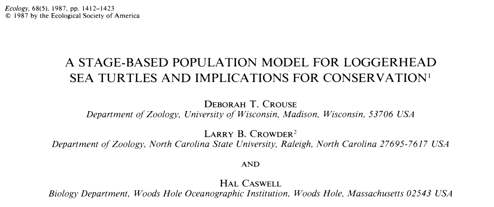
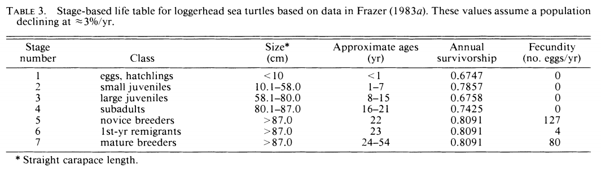
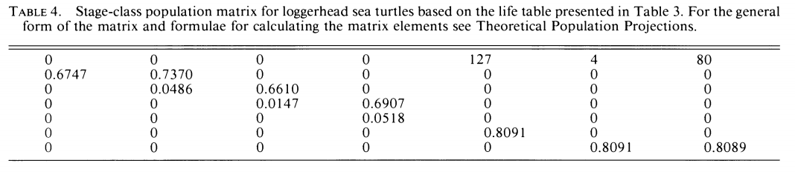

```{r setup, include=FALSE}
knitr::opts_chunk$set(echo = TRUE, collapse = T)
```

# An outline of structured population models

--

* Age-structured populations
  * A diversion on matrix math
* Stage-structured populations

---
background-image: url(https://i.imgflip.com/25i7oj.jpg)
class: inverse

---
# Age- structured populations

--

1. We have thus far examined how populations have changed assuming **the population is entirely homogeneous**

--

2. For many reasons, we might wish to more precisely model and analyze populations with respect to their age structure. That is, looking at the probabilities of survival and fecundity at each age.

--

* For simplifiction, we are working with discrete-time, discrete-age models

---
# The simplest case: two age classes

* Imagine a species that lives for two years; e.g., a biennial plant. The seeds germinate at the beginning of the first year (age 0), and they leaf out and photosynthesize. During the second year (age 1), the plant flowers, sets seed, and dies.

--

* Verbally, the model that I just described could be more concisely written as:
$$\begin{align}
&\text{zero-year-old plants = (# one-year-old plants)*fecundity} \\
&\text{one-year-old plants = zero-year-old plants that survived}
\end{align}$$

--

* Let's play with some simple numbers:
  * Let's say that the average one-year-old plants $(x_1)$ produces 25 seeds $(f = 25)$ that germinate the following year
  * Let's say that, on average, about 20% of zero-year-old plants $(x_0)$ survive $(p_{\text{survive from age class 0 to 1}})$ to the second year $(x_1)$
  * Lastly, if we initially had 5 and 2 individuals respectively of $x_0$ and $x_1$

--

* Calculate, by hand, how many individuals would exist at each age after 5 years

---
# The simplest case: two age classes
## Results

.pull-left[
t | $x_0$ | $x_1$ |
--|:-:|:-:|
0 | 5 | 2
1 | 50 | 1
2 | 25 | 10
3 | 250 | 5
4 | 125 | 50
5 | 1250 | 25
]

--

.pull-right[
```{r echo = F, fig.width = 4, fig.height = 4, dpi = 400, out.height = 400, out.width = 450}
times <- 0:5
x <- c(5, 50, 25, 250, 125, 1250)
y <- c(2, 1, 10, 5, 50, 25)
xy_sum <- x+y
par(mar = c(4, 4, 0.1, 0.1), lwd = 1.5)
plot(x = times, y = xy_sum, las = 1, type = "l", xlab = "Year", ylab = "Density", lwd = 2)
```
]

---
# The simplest case: two age classes
## Results, with each age class

.pull-left[

t | $x_0$ | $x_1$ |
--|:-:|:-:|
0 | 5 | 2
1 | 50 | 1
2 | 25 | 10
3 | 250 | 5
4 | 125 | 50
5 | 1250 | 25
]

.pull-right[
```{r echo = F, fig.width = 4, fig.height = 4, dpi = 400, out.height = 400, out.width = 450}
times <- 0:5
x <- c(5, 50, 25, 250, 125, 1250)
y <- c(2, 1, 10, 5, 50, 25)
xy_sum <- x+y
par(mar = c(4, 4, 0.1, 0.1), lwd = 1.5)
plot(x = times, y = xy_sum, las = 1, type = "l", xlab = "Year", ylab = "Density", lwd = 2)
lines(x = times, y = x, col = "red")
lines(x = times, y = y, col = "blue")
legend("topleft", col = c("red", "blue"), legend = c("x_0", "x_1"), bty = "n", lty = 1)
```
]

---
# The condensed way: matrix operations
From a few slides back:
* Verbally, the model that I just described could be more concisely written as:
$$\begin{align}\text{zero-year-old plants = (# one-year-old plants)*fecundity} \\
\text{one-year-old plants = zero-year-old plants that survived}
\end{align}$$

--

As a pair of equations, we can write
$$\begin{align}
x_0(t+1) &= 25x_1(t) \\
x_1(t+1) &= 0.2x_0(t)
\end{align}$$

--

which is the same as
$$\begin{align}
x_0(t+1) &= 0x_0(t) + 25x_1(t) \\
x_1(t+1) &= 0.2x_0(t) + 0x_1(t)
\end{align}$$

---
# The condensed way: matrix operations

$$\begin{align}
x_0(t+1) &= 0x_0(t) + 25x_1(t) \\
x_1(t+1) &= 0.2x_0(t) + 0x_1(t)
\end{align}$$
--
Can be represented as
$$\begin{bmatrix}
x_0(t+1) \\
x_1(t+1)
\end{bmatrix}$$
---
# The condensed way: matrix operations

$$\begin{align}
x_0(t+1) &= 0x_0(t) + 25x_1(t) \\
x_1(t+1) &= 0.2x_0(t) + 0x_1(t)
\end{align}$$

Can be represented as
$$\begin{gather}\begin{bmatrix}
x_0(t+1) \\
x_1(t+1)
\end{bmatrix} = \begin{bmatrix}
0 & 25 \\
0.2 & 0
\end{bmatrix}\end{gather}$$

---
# The condensed way: matrix operations

$$\begin{align}
x_0(t+1) &= 0x_0(t) + 25x_1(t) \\
x_1(t+1) &= 0.2x_0(t) + 0x_1(t)
\end{align}$$

Can be represented as
$$\begin{gather}\begin{bmatrix}
x_0(t+1) \\
x_1(t+1)
\end{bmatrix} = \begin{bmatrix}
0 & 25 \\
0.2 & 0
\end{bmatrix}\begin{bmatrix}
x_0(t) \\
x_1(t)
\end{bmatrix}\end{gather}$$

--

Symbolically with parameters rather than numbers we can write:
$$\begin{gather}\begin{bmatrix}
x_0(t+1) \\
x_1(t+1)
\end{bmatrix} = \begin{bmatrix}
0 & f_1 \\
p_{10} & 0
\end{bmatrix}\begin{bmatrix}
x_0(t) \\
x_1(t)
\end{bmatrix}\end{gather}$$

---
# Structured populations models
## With 3 age classes

$$\begin{gather}\begin{bmatrix}
x_0(t+1) \\
x_1(t+1) \\
x_2(t+1)
\end{bmatrix} = \begin{bmatrix}
0 & f_1 & f_2 \\
p_{10} & 0 & 0 \\
0 & p_{21} & 0
\end{bmatrix}\begin{bmatrix}
x_0(t) \\
x_1(t) \\
x_2(t)
\end{bmatrix}\end{gather}$$

---
# Structured populations models
## With 4 age classes

$$\begin{gather}\begin{bmatrix}
x_0(t+1) \\
x_1(t+1) \\
x_2(t+1) \\
x_3(t+1)
\end{bmatrix} = \begin{bmatrix}
0 & f_1 & f_2 & f_3 \\
p_{10} & 0 & 0 & 0 \\
0 & p_{21} & 0 & 0 \\
0 & 0 & p_{32} & 0
\end{bmatrix}\begin{bmatrix}
x_0(t) \\
x_1(t) \\
x_2(t) \\
x_3(t)
\end{bmatrix}\end{gather}$$

---
# Structured populations models
## With arbitrary $(n)$ numers of age classes

$$\begin{gather}\begin{bmatrix}
x_0(t+1) \\
x_1(t+1) \\
x_2(t+1) \\
x_3(t+1) \\
\vdots \\
x_n(t+1)
\end{bmatrix} = \begin{bmatrix}
0 & f_1 & f_2 & f_3 & \dots & f_{m-1} \\
p_{10} & 0 & 0 & 0  & & 0 \\
0 & p_{21} & 0 & 0 & & 0 \\
0 & 0 & p_{32} & 0 & & 0 \\
\vdots & & & \ddots & & \vdots \\
0 & \dots & & & p_{n, m-1} & 0
\end{bmatrix}\begin{bmatrix}
x_0(t) \\
x_1(t) \\
x_2(t) \\
x_3(t) \\
\vdots \\
x_n(t)
\end{bmatrix}\end{gather}$$


---
# Some matrix math: notation
Annotation in **bold** signifies that we are working with matrices.

--

For instance, the first, 2-age-class model
$$\begin{gather}\begin{bmatrix}
x_0(t+1) \\
x_1(t+1)
\end{bmatrix} = \begin{bmatrix}
0 & f_1 \\
p_{10} & 0
\end{bmatrix}\begin{bmatrix}
x_0(t) \\
x_2(t)
\end{bmatrix}\end{gather}$$

can be written more concisely as

$$\mathbf{X(t+1) = PX(t)}$$

---
# Some matrix math: multiplication
It's important to note that a vector is a matrix with one column; e.g., as the depicted $\mathbf{x}$ above.

--

Second, let's multiply a matrix times a vector by hand. Let's say you have a matrix that looks like this:
$$\begin{gather}
? = \begin{bmatrix}
0 & 4 & 8 \\
0.1 & 0 & 0 \\
0 & 0.9 & 0
\end{bmatrix}\begin{bmatrix}
6 \\
4 \\
2
\end{bmatrix}\end{gather}$$

(Think about how you did this in the biennial-plant problem.)

--

$$\begin{gather}\begin{bmatrix}
6(0) + 4(4) + 2(8) \\
6(0.1) + 4(0) + 2(0) \\
6(0) + 4(0.9) + 2(0)
\end{bmatrix} = \begin{bmatrix}
0 & 4 & 8 \\
0.1 & 0 & 0 \\
0 & 0.9 & 0
\end{bmatrix}\begin{bmatrix}
6 \\
4 \\
2
\end{bmatrix}\end{gather}$$

---
# Some matrix math: multiplication
It's important to note that a vector is a matrix with one column; e.g., as the depicted $\mathbf{x}$ above.

Second, let's multiply a matrix times a vector by hand. Let's say you have a matrix that looks like this:
$$\begin{gather}
? = \begin{bmatrix}
0 & 4 & 8 \\
0.1 & 0 & 0 \\
0 & 0.9 & 0
\end{bmatrix}\begin{bmatrix}
6 \\
4 \\
2
\end{bmatrix}\end{gather}$$

(Think about how you did this in the biennial-plant problem.)

$$\begin{gather}\begin{bmatrix}
32 \\
0.6 \\
3.6
\end{bmatrix} = \begin{bmatrix}
6(0) + 4(4) + 2(8) \\
6(0.1) + 4(0) + 2(0) \\
6(0) + 4(0.9) + 2(0)
\end{bmatrix} = \begin{bmatrix}
0 & 4 & 8 \\
0.1 & 0 & 0 \\
0 & 0.9 & 0
\end{bmatrix}\begin{bmatrix}
6 \\
4 \\
2
\end{bmatrix}\end{gather}$$
---
# Some matrix math: using R 😌 :relieved:
First, build the projection matrix and population vector

$$\begin{gather}
? = \begin{bmatrix}
0 & 4 & 8 \\
0.1 & 0 & 0 \\
0 & 0.9 & 0
\end{bmatrix}\begin{bmatrix}
6 \\
4 \\
2
\end{bmatrix}\end{gather}$$

--

```{r echo = T}
proj.mat <- matrix(data = c(0, 0.1, 0, 4, 0, 0.9, 8, 0, 0), nrow = 3, ncol = 3)
proj.mat
N.vec <- matrix(data = c(6, 4, 2), nrow = 3, ncol = 1)
N.vec
```

---
# Some matrix math: using R
```{r echo = T, error = T}
proj.mat*N.vec
```

--

```{r}
proj.mat%*%N.vec
```

This is matrix multiplication (AKA, the inner product)!

--

Also, it's important to note that matrix multiplication is non-commutative
```{r, error = T}
N.vec%*%proj.mat
```

---
# Projecting matrix models
## Write a for loop for the matrix you just created

--

```{r}
steps <- 7
N.mat <- matrix(data = NA, ncol = steps, nrow = length(N.vec))
N.mat[,1] <- N.vec
for (i in 2:steps){
  N.mat[,i] <- proj.mat%*%N.mat[,i-1]
}
```

--

To sum across columns, use the `apply()` function

```{r}
sumN <- apply(X = N.mat, MARGIN = 2, FUN = sum)
sumN
```

(The MARGIN = 2 means apply the function over the columns; to apply a funciton over rows use MARGIN = 1)

---
# Visualizing a structured model
```{r include = F}
steps <- 20
N.mat <- matrix(data = NA, ncol = steps, nrow = length(N.vec))
N.mat[,1] <- N.vec
for (i in 2:steps){
  N.mat[,i] <- proj.mat%*%N.mat[,i-1]
}
sumN <- apply(X = N.mat, MARGIN = 2, FUN = sum)
```

```{r fig.width = 5, fig.height = 5}
plot(x = 1:steps, y = sumN, type = "l", xlab = "Time step", ylab = "Density", las = 1)
points(x = 1:steps, y = sumN, pch = 16, cex = 1.25)
```

---
# Visualizing a structured model
```{r include = F}
steps <- 20
N.mat <- matrix(data = NA, ncol = steps, nrow = length(N.vec))
N.mat[,1] <- N.vec
for (i in 2:steps){
  N.mat[,i] <- proj.mat%*%N.mat[,i-1]
}
sumN <- apply(X = N.mat, MARGIN = 2, FUN = sum)
```

```{r fig.width = 5, fig.height = 5}
plot(x = 1:steps, y = sumN, type = "l", xlab = "Time step", ylab = "Density", las = 1)
points(x = 1:steps, y = sumN, pch = 16, cex = 1.25); segments(x0 = 1, x1 = 11, y0 = 50, y1 = 50, lwd = 1.5, lty = 2); text(x = 6, y = 53, labels = "Transience"); segments(x0 = 12.5, x1 = 20, y0 = 40, y1 = 59, lwd = 1.5); text(x = 17.5, y = 40, labels = "Stable(-ish)\nage\ndistribution")
```


---

# Visualizing a structured model (each age class)
```{r include = F}
steps <- 20
N.mat <- matrix(data = NA, ncol = steps, nrow = length(N.vec))
N.mat[,1] <- N.vec
for (i in 2:steps){
  N.mat[,i] <- proj.mat%*%N.mat[,i-1]
}
sumN <- apply(X = N.mat, MARGIN = 2, FUN = sum)
```

.pull-left[
Same figure from previous slide, with the total population size
```{r fig.width=5, fig.height=5, echo = F}
plot(x = 1:steps, y = sumN, type = "l", xlab = "Time step", ylab = "Density", las = 1, ylim = c(0, 65))
points(x = 1:steps, y = sumN, pch = 16, cex = 1.25)
```
]

--

.pull-right[
Each age class as different colors; grey as the total population)
```{r fig.width=5, fig.height=5, echo = F}
plot(x = 1:steps, y = sumN, type = "l", xlab = "Time step", ylab = "Density", las = 1, ylim = c(0, 65), col = "grey80")
points(x = 1:steps, y = sumN, pch = 16, cex = 1.25, col = "grey80")
lines(x = 1:steps, y = N.mat[1,], col = "orange")
points(x = 1:steps, y = N.mat[1,], pch = 16, cex = 1.25, col = "orange")
lines(x = 1:steps, y = N.mat[2,], pch = 16, cex = 1.25, col = "red")
points(x = 1:steps, y = N.mat[2,], pch = 16, cex = 1.25, col = "red")
lines(x = 1:steps, y = N.mat[3,], cex = 1.25, col = "blue")
points(x = 1:steps, y = N.mat[3,], pch = 16, cex = 1.25, col = "blue")
```
]


---
# Visualizing a structured model (each age class)

```{r include = F}
steps <- 50
N.mat <- matrix(data = NA, ncol = steps, nrow = length(N.vec))
N.mat[,1] <- N.vec
for (i in 2:steps){
  N.mat[,i] <- proj.mat%*%N.mat[,i-1]
}
sumN <- apply(X = N.mat, MARGIN = 2, FUN = sum)
```

```{r fig.width = 10, fig.height = 5, echo = F}
par(mfrow = c(1, 2), mar = c(5, 5, 0.1, 0.1))
plot(x = 1:steps, y = sumN, type = "l", xlab = "Time step", ylab = "Density", las = 1, ylim = c(0,250), col = "grey80")
points(x = 1:steps, y = sumN, pch = 16, cex = 1.25, col = "grey80")
lines(x = 1:steps, y = N.mat[1,], col = "orange")
points(x = 1:steps, y = N.mat[1,], pch = 16, cex = 1.25, col = "orange")
lines(x = 1:steps, y = N.mat[2,], pch = 16, cex = 1.25, col = "red")
points(x = 1:steps, y = N.mat[2,], pch = 16, cex = 1.25, col = "red")
lines(x = 1:steps, y = N.mat[3,], cex = 1.25, col = "blue")
points(x = 1:steps, y = N.mat[3,], pch = 16, cex = 1.25, col = "blue")

plot(x = 1:steps, y = log(sumN), type = "l", xlab = "Time step", ylab = "Density (log scale)", las = 1, ylim = c(-1,6), col = "grey80")
points(x = 1:steps, y = log(sumN), pch = 16, cex = 1.25, col = "grey80")
lines(x = 1:steps, y = log(N.mat[1,]), col = "orange")
points(x = 1:steps, y = log(N.mat[1,]), pch = 16, cex = 1.25, col = "orange")
lines(x = 1:steps, y = log(N.mat[2,]), pch = 16, cex = 1.25, col = "red")
points(x = 1:steps, y = log(N.mat[2,]), pch = 16, cex = 1.25, col = "red")
lines(x = 1:steps, y = log(N.mat[3,]), cex = 1.25, col = "blue")
points(x = 1:steps, y = log(N.mat[3,]), pch = 16, cex = 1.25, col = "blue")
```

---
# Visualizing a structured model (many time steps)

```{r include = F}
steps <- 200
N.mat <- matrix(data = NA, ncol = steps, nrow = length(N.vec))
N.mat[,1] <- N.vec
for (i in 2:steps){
  N.mat[,i] <- proj.mat%*%N.mat[,i-1]
}
sumN <- apply(X = N.mat, MARGIN = 2, FUN = sum)
```

```{r fig.width = 5, fig.height = 5}
plot(x = 1:steps, y = sumN, type = "l", xlab = "Time step", ylab = "Density", las = 1)
points(x = 1:steps, y = sumN, pch = 16, cex = 1.25)
```


---
# Can we relate stable-age distribution growth with a constant value $(\lambda)$?

--

Yes!!!

--

.pull-left[
Structured-population growth at a stable-age distribution
$$\begin{align}
\mathbf{N}_{t+1} &= \lambda \mathbf{N}_t \\
\mathbf{N}_{t+2} &= \lambda \mathbf{N}_{t+1} = \lambda \lambda \mathbf{N}_t = \lambda ^2\mathbf{N}_t \\
\dots \\
\mathbf{N}_{t+n} &= \lambda ^n\mathbf{N}_t
\end{align}$$
]

--

.pull-right[
General structured-population growth
$$\begin{align}
\mathbf{N}_{t+1} &= \mathbf{P}\mathbf{N}_t \\
\mathbf{N}_{t+2} &= \mathbf{P}\mathbf{N}_{t+1} = \mathbf{P}\mathbf{P}\mathbf{N}_t = \mathbf{P}^2N_t \\
\dots \\
\mathbf{N}_{t+n} &= \mathbf{P}^n\mathbf{N}_t
\end{align}$$
]

--


*Et vualá*: $\mathbf{P}^n\mathbf{N}_t = \lambda ^n\mathbf{N}_t$


---
# A characteristic of matrices: die eigenvalue

--

It turns out if we have a projection matrix, *we can solve for the finite rate of increase $(\lambda)$*!

--

We just need to solve for $(\lambda)$ from the pervious slide, $\mathbf{P}^n\mathbf{N}_t = \lambda ^n\mathbf{N}_t$

--

To do so, we need to conform both sides to one another (LHS is a matrix, RHS is a scalar) (eqn. 10), then solve for $(\lambda)$ (equation 10 until the end of the section)

--

Read the derivation in the book and know that the dominant eigenvalue (the largest absoute value) is equal to the finite rate of increase. Knowing that relation is important, but for finding it we should let R do it for us. In R, the eigenvalues can be found of a matrix by using the function `eigen()`. Do this over the matrix we've been looking at:

$$\begin{gather}
? = \begin{bmatrix}
0 & 4 & 8 \\
0.1 & 0 & 0 \\
0 & 0.9 & 0
\end{bmatrix}\begin{bmatrix}
6 \\
4 \\
2
\end{bmatrix}\end{gather}$$

--
An interactive webpage to help usederstand eigenvalues, in general: [http://setosa.io/ev/eigenvectors-and-eigenvalues/](http://setosa.io/ev/eigenvectors-and-eigenvalues/)

---
class: inverse, middle, center
# Hopefully you feel confident about these age structured models (now)!


---
class: inverse, center, middle
# Stage structured models

---
# Stage structured models
So far we have learned about age-structured models, where, with the exception to those organisms that transcend time, indiviudals must move from one age class to another. BUT, we can also model populations that are also structured demographically by *stage*. This allows us to reduce the number of effective classes (e.g., if survival and fecundity of a 44- and 45-year-old human is the same, then the classes are redundant) to more easily analyze the population dynamics.

--

As an example, imagine a population of holometabolan (complete metamorphosis) insects, say a dung beetle, with 4 age classes: egg, larva, pupa, adult. The adults can live many years, but the other three stages advance each year.
---
# Stage structured models: sea turtles



---
# Stage structured models: sea turtles



--


